# Instagram Authenticator

The Instagram authenticator is configured as a federated authenticator in WSO2 Identity Server to authenticate Instagram users to log in to your organization’s applications. Instagram is an online mobile photo-sharing, video-sharing, and social networking service. This enables its users to take pictures and videos, and share them on a variety of social networking platforms.

The diagram below illustrates the flow of the Instagram federated authenticator.
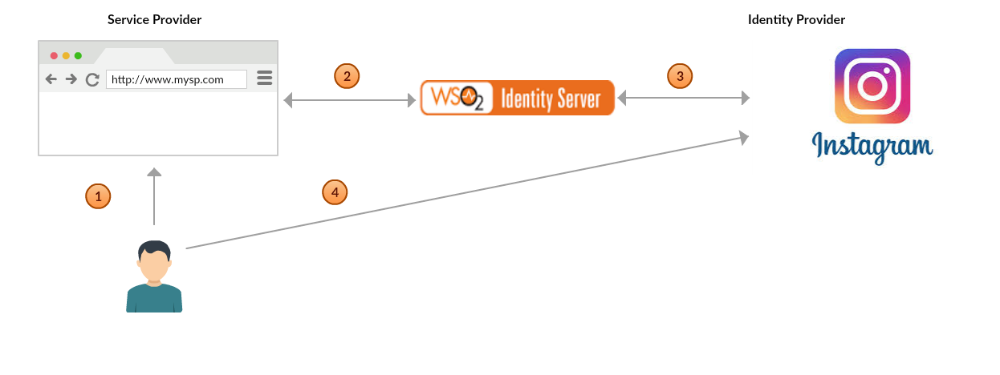

This page provides instructions on how to configure the Instagram authenticator and Identity Server using a sample app. You can find more information in the following sections.

```
This is tested with the Instagram API version 1.0 (v1). Instagram authenticator is supported by Identity Server 5.1.0 upwards.
```

* [Deploying Instagram artifacts](#Deploying-Instagram-artifacts)
* [Configuring the Instagram App](#Configuring-the-Instagram-App)
* [Deploying travelocity.com sample app](#Deploying-travelocity.com-sample-app)
* [Configuring the identity provider](#Configuring-the-identity-provider)
* [Configuring the service provider](#Configuring-the-service-provider)
* [Configuring claims](#Configuring-claims)
* [Configuring requested claims for travelocity.com](#Configuring-requested-claims-for-travelocity.com)
* [Testing the sample](#Testing-the-sample)

## Deploying Instagram artifacts

* Either Download the artifacts for this authenticator from [the store](https://store.wso2.com/store/assets/isconnector/details/175db9b2-1aae-4402-adee-94c4acd751d2) or [build the project](Building From the Source) to get the jar and by adding it in the <IS-Home>/repository/components/dropins directory.

* If you want to upgrade the Instagram Authenticator (.jar) in your existing IS pack, follow the bellow instructions.
  * Stop WSO2 Identity Server if the server is already running.
  * Download and extract the latest version of the authenticator artifacts (.jar, .war, gadgets etc.,) from the connector store.
  * Replace the old .jar file(org.wso2.carbon.extension.identity.authenticator.instagram.connector-x.x.x.jar) found in the <IS_HOME>/repository/components/dropins folder with the new .jar file that you downloaded.
  
## Building From the Source

Follow the steps given below to build the Instagrqam authenticator from the source code:

1. Get a clone or download the source from [Github](https://github.com/wso2-extensions/identity-outbound-auth-instagram).
2. Run the following maven command from the `identity-outbound-auth-instagram` directory: `mvn clean install`.
3. org.wso2.carbon.extension.identity.authenticator.instagram.connector-x.x.x.jar file is created in the `identity-outbound-auth-instagram/component/target` directory.

## Configuring the Instagram App

1. Download the `Instagram` app for iOS from the App Store, Android from Google Play Store or Windows Phone from the Windows Phone Store. 

2. Once the app is installed, tap to open it. 

3. Sign up and create an account using your email ID.

4. Navigate to https://www.instagram.com/ and log in using the credentials that you used to create the account.

5. Navigate to https://www.instagram.com/developer/ and click the `Register Your Application` button and register a new client.

6. Use  https://localhost:9443/commonauth  as the redirect URL when you register the client.
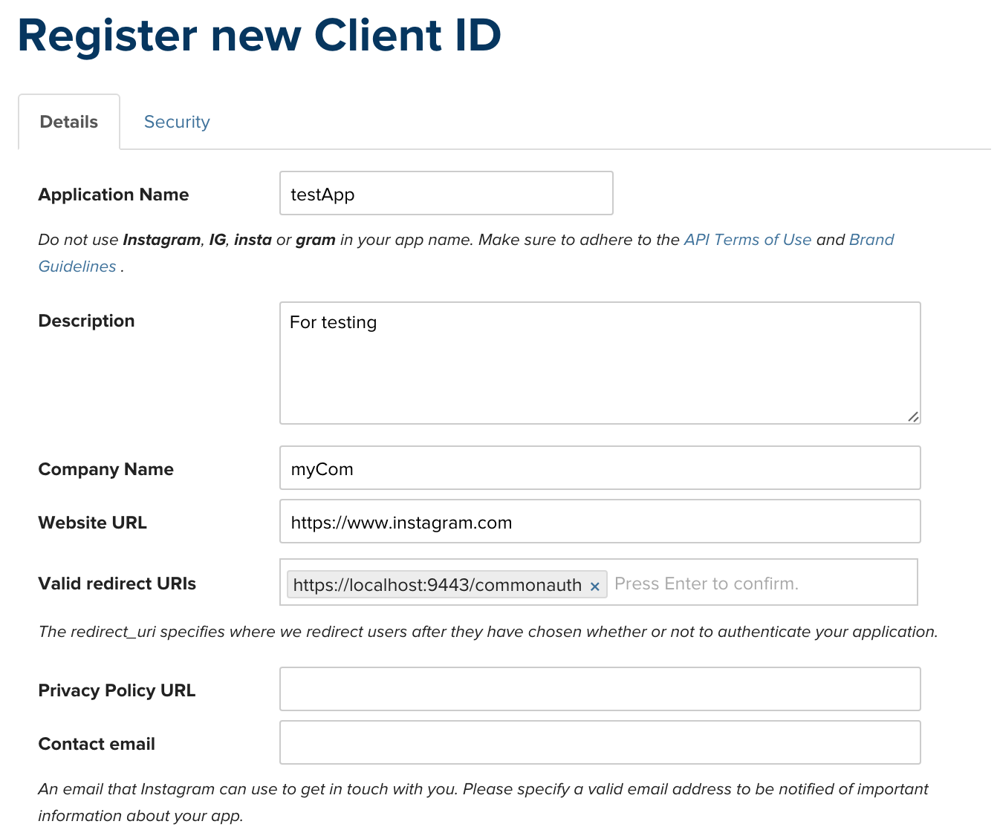
    ```
    If you are getting an error while registering you may have to "Disable Content Security Policy". It is recommended to enable content security policy, once you registered into the app.
    ```
    
7. From the app dashboard you can get the `clientId` and `clientSecret` for your created app. 

## Deploying travelocity.com sample app

To ensure you get the full understanding of configuring authenticator with WSO2 IS, the sample travelocity application is used in this use case. The samples run on the Apache Tomcat server and are written based on Servlet 3.0. Therefore, download Tomcat 7.x from [here](https://tomcat.apache.org/download-70.cgi).
Install Apache Maven to build the samples. For more information, see [Installation Prerequisites](https://docs.wso2.com/display/IS570/Installation+Prerequisites).

Follow the steps below to deploy the travelocity.com sample application:

### Download the samples

To be able to deploy a sample of Identity Server, you need to download it onto your machine first. 

Follow the instructions below to download a sample from GitHub.

* Create a folder in your local machine and navigate to it using your command line.

* Run the following commands.
  ```
  mkdir is-samples
  cd is-samples/
  git init
  git remote add -f origin https://github.com/wso2/product-is.git
  git config core.sparseCheckout true
  ```
  
* Navigate into the .git/info/ directory and list out the folders/files you want to check out using the echo command below.
    ``` 
    cd .git
    cd info
    echo "modules/samples/" >> sparse-checkout
    ```
    
* Navigate out of .git/info directory and checkout the v5.4.0 tag to update the empty repository with the remote one.
    ```
    cd ..
    cd ..
    git checkout -b v5.4.0 v5.4.0
    ```
* Go to is-samples/modules/samples/sso/sso-agent-sample directory and run `mvn clean install` and get the war file from the target folder.

### Deploy the sample web app

Deploy this sample web app on a web container.

1. Use the Apache Tomcat server to do this. If you have not downloaded Apache Tomcat already, download it from [here](https://tomcat.apache.org/download-70.cgi).

2. Copy the .war file into the  webapps  folder. For example,  <TOMCAT_HOME>/apache-tomcat-<version>/webapps .

3. Start the Tomcat server. 

    To check the sample application, navigate to http://<TOMCAT_HOST>:<TOMCAT_PORT>/travelocity.com/index.jsp on your browser.
    For example, `http://localhost:8080/travelocity.com/index.jsp.`
    ```
    Note: It is recommended that you use a hostname that is not localhost to avoid browser errors. Modify the /etc/hosts entry in your machine to reflect this. Note that localhost is used throughout thisdocumentation as an example, but you must modify this when configuring these authenticators or connectors with this sample application.
    ```
    
Once this is done, the next step is to configure the WSO2 Identity Server by adding an identity provider and service provider.

## Configuring the identity provider

Now you have to configure WSO2 Identity Server by [adding a new identity provider](https://docs.wso2.com/display/IS570/Adding+and+Configuring+an+Identity+Provider).

* Download the WSO2 Identity Server from [here](http://wso2.com/products/identity-server/).

* Go to https://api.instagram.com in your browser, and then click the HTTPS trust icon on the address bar (e.g., the padlock next to the URL) to download the certificate. If you are using google chrome please follow the steps of inspecting certificates in chrome to export the certificate.

* Import that certificate into the IS client keystore by running the following command on your command line.

    `keytool -importcert -file <certificate file> -keystore <IS_HOME>/repository/resources/security/client-truststore.jks -alias "Instagram"`

  Note that 'wso2carbon' is the keystore password of the default client-truststore.jks file. We need the certificate in order to validate the signature. Otherwise, it is unable to prove that the response is sent by the relevant identity provider we configured.

* Run the [WSO2 Identity Server](https://docs.wso2.com/display/IS570/Running+the+Product).

* Log in to the [management console](https://docs.wso2.com/display/IS570/Getting+Started+with+the+Management+Console) as an administrator.

* In the `Identity Providers` section under the `Main` tab of the management console, click `Add`.

* Give a suitable name for `Identity Provider` Name and configure the authenticator. To do this, navigate to `Instagram Configuration` under `Federated Authenticators` and fill the form.
    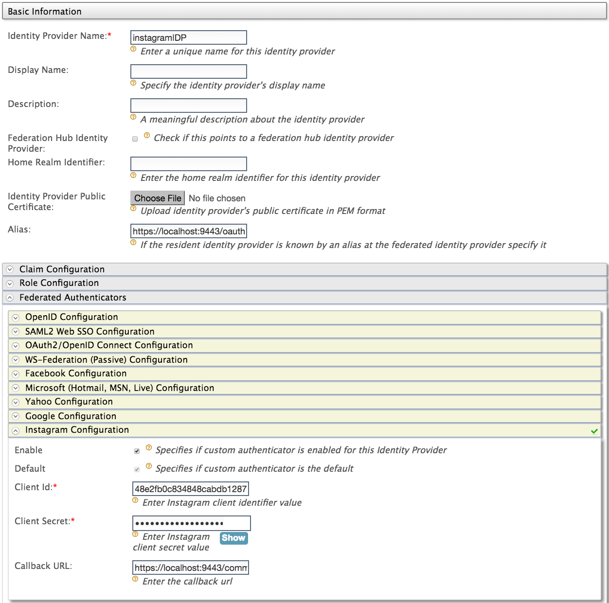
 
    Do the following configurations.
    
    |Field|Description|Sample value|
    |----|----|----|
    |Enable|Selecting this option enables Instagram to be used as an authenticator for users provisioned to the Identity Server.|Selected|
    |Default|Selecting the 'Default' checkbox signifies that Instagram is the main/default form of authentication. This removes the selection made for any other 'Default' checkboxes for other authenticators.|Selected|
    |Client Id|This is the username from the Instagram application.|aa6f12fd086e4b58a6707d5b61377a71|
    |Client Secret|This is the password from the Instagram application. Click the Show button to view the value you enter.|fffc3f4808f34e01b0bc529ce78f5980|
    |Callback URL|This is the URL to which the browser should be redirected after the authentication is successful. It should have this format: https://(host-name):(port)/acs.|https://localhost:9443/commonauth|
    
* Select both checkboxes to `Enable` the Instagram authenticator and make it the `Default`.

* Click Register.

You have now added the identity provider.

## Configuring the service provider

The next step is to configure the service provider.

1. Return to the management console.

2. In the `Service Providers` section, click `Add` under the `Main` tab.

3. Since you are using travelocity as the sample, enter travelocity.com in the `Service Provider Name` text box and click `Register` .

4. In the `Inbound Authentication Configuration` section, click `Configure` under the `SAML2 Web SSO Configuration` section.

5. Now set the configuration as follows:
    1. Issuer: travelocity.com
    2. Assertion Consumer URL: http://localhost:8080/travelocity.com/home.jsp
    
6. Select the following check-boxes:
    1. Enable Response Signing.
    2. Enable Single Logout. 
    3. Enable Attribute Profile.
    4. Include Attributes in the Response Always.

   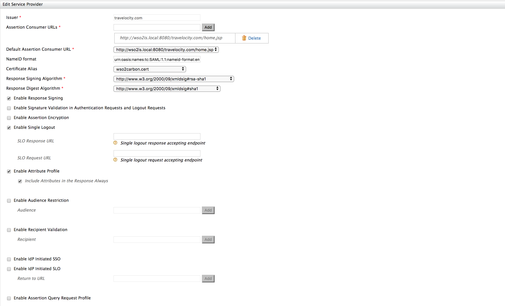
   
7. Click `Update` to save the changes. Now you will be sent back to the `Service Providers` page.

8. Navigate to the Local and `Outbound Authentication Configuration` section.
 
9. Select the identity provider you created from the drop-down list under `Federated Authentication`.
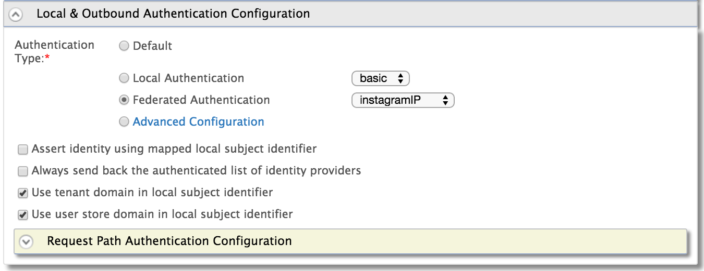

10. Ensure that the `Federated Authentication` radio button is selected and click  `Update` to save the changes. 

You have now added and configured the service provider.

```
Related Topics
For more information on service provider configuration, see https://docs.wso2.com/display/IS570/Configuring+Single+Sign-On.
```

## Configuring claims

This involves adding a new [claim mapping](https://docs.wso2.com/display/IS570/Adding+Claim+Mapping) for various user attributes related to Instagram.

* In the `Main` menu, click `Add` under `Claims`.

* Click `Add New Claim Dialect` to create the Instagram authenticator specific claim dialect.
  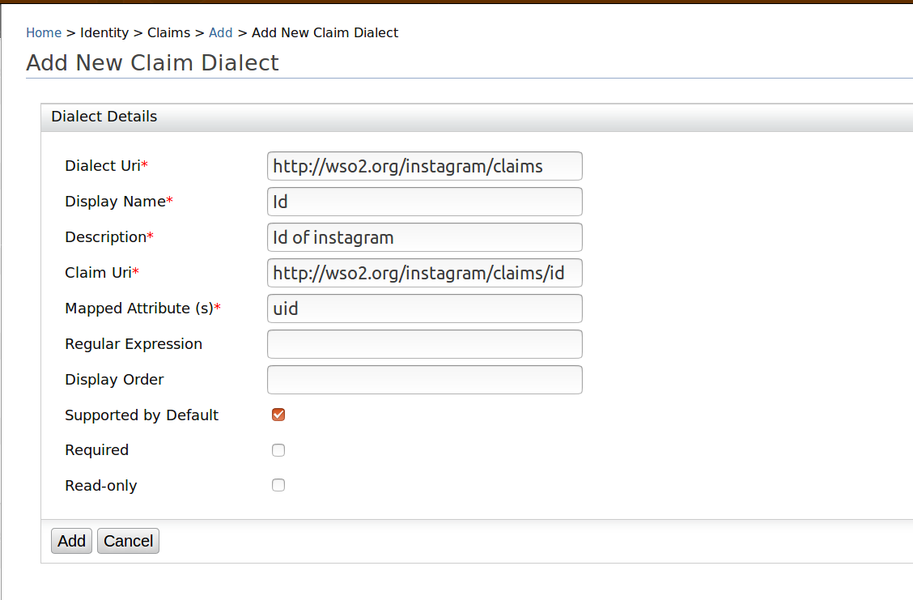
  
* Specify the Dialect Uri as `http://wso2.org/instagram/claims` and create claims. It is required to create at least one claim under this new dialect. Therefore, create the claim for the Instagram user ID while creating the claim dialect. Enter the following values the form.

* Click `Add` to add the new claim.

* Similarly, you can create claims for all the public information of the Instagram user. Add the following claims under the dialect `http://wso2.org/instagram/claims`
    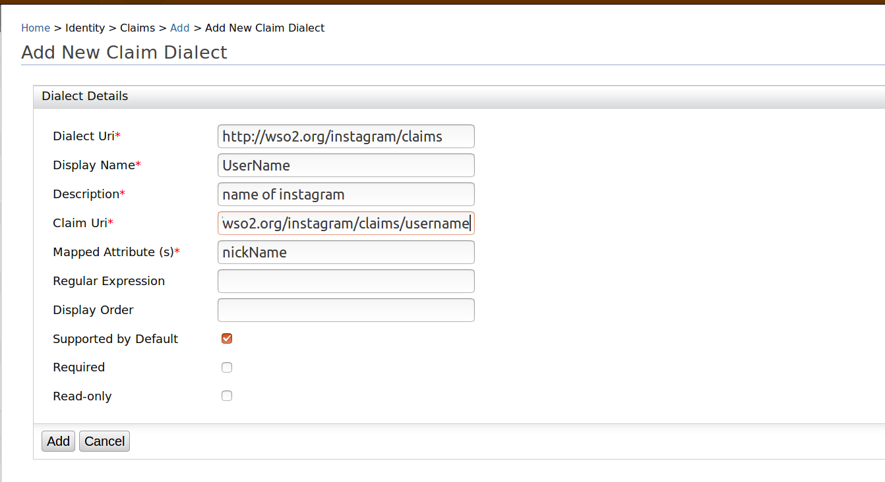
    
    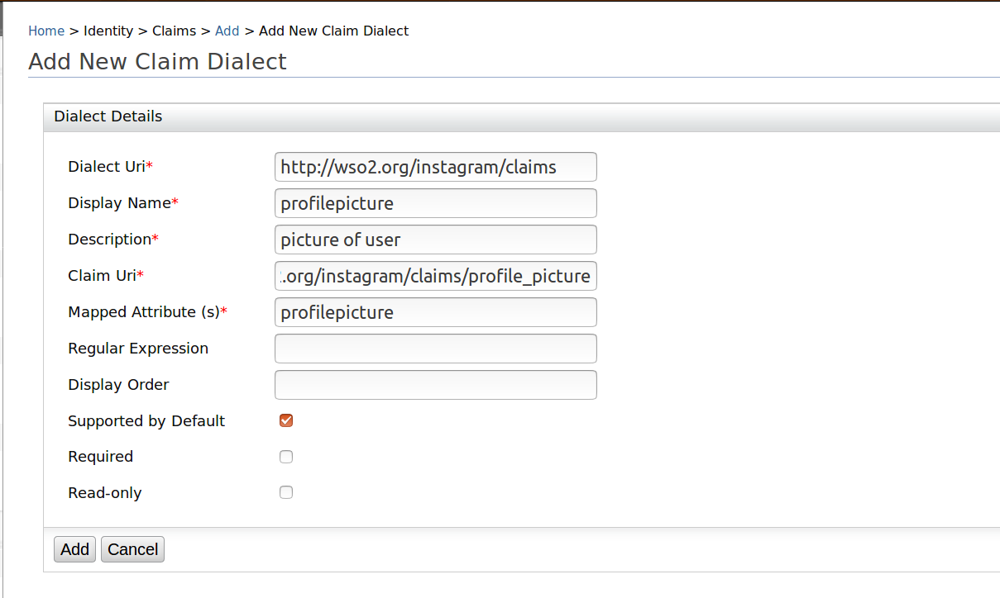
    
* You can create the local claim to map it with the Instagram claim. Create the local claim `http://wso2.org/claims/profilepicture`  with the map attribute `profile picture`.
    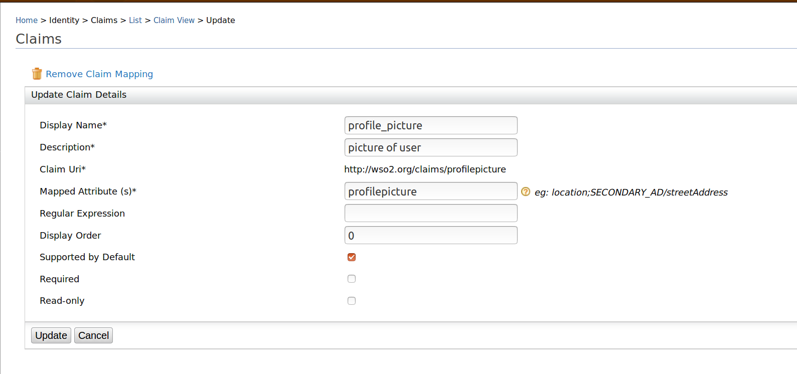
    
## Configuring requested claims for travelocity.com

* In the `Identity` section under the `Main` tab, click `List` under `Service Providers`.

* Click `Edit` to edit the travelocity.com service provider.

* Expand the `Claim Configuration` section.

* Click on Add `Claim URI` under `Requested Claims` to add the requested claims as indicated in the image below. Here you must add the claims you mapped in the Identity Provider claim configuration.
    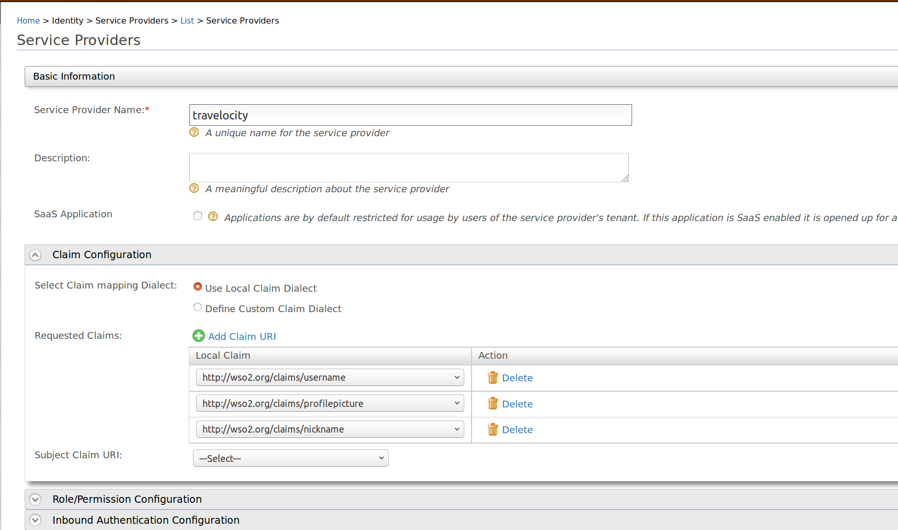
    
## Testing the sample

1. To test the sample, go to the following URL: http://<TOMCAT_HOST>:<TOMCAT_PORT>/travelocity.com/index.jsp. E.g., http://localhost:8080/travelocity.com

2. Login with SAML from the WSO2 Identity Server.
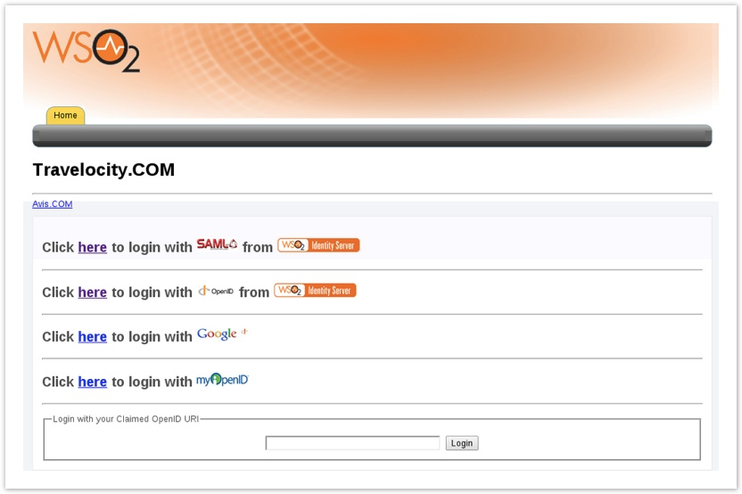

    If you checkout from tag v5.7.0 when you downloading the sample then login with SAML(Redirect binding).
    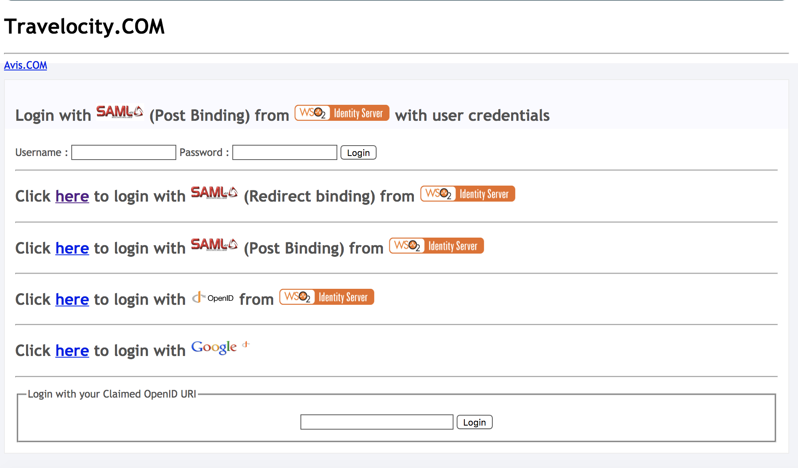
    
3. Enter your Instagram credentials in the prompted login page of Instagram. Once you login successfully you will be taken to the home page of the travelocity.com app.
    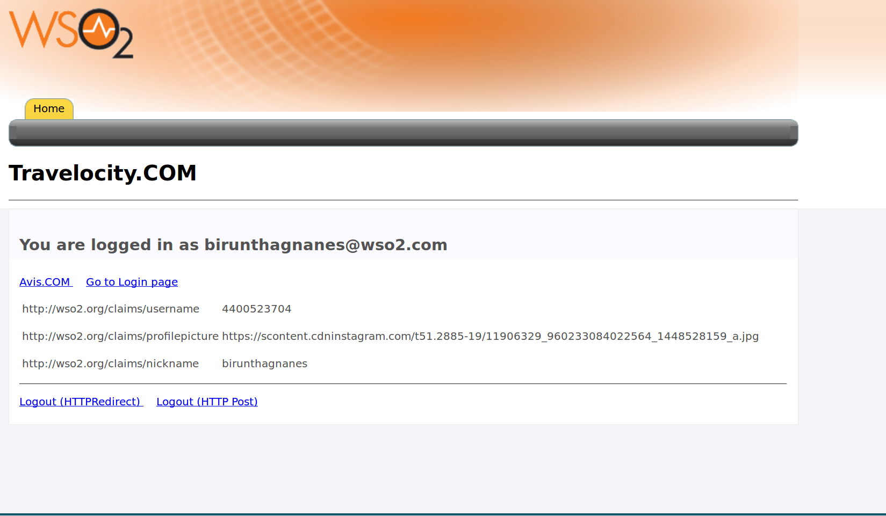
    